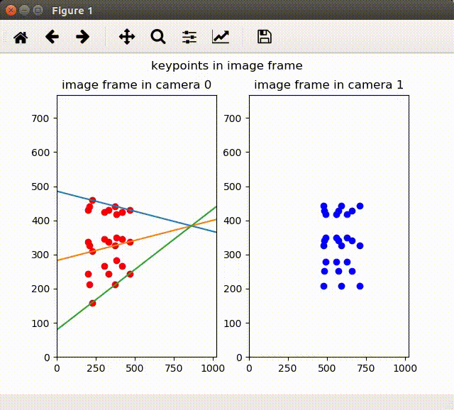

## Multi view geometry key concepts in Python
[](https://travis-ci.com/xeonqq/multiple_view_geometry) [](https://lgtm.com/projects/g/xeonqq/multiple_view_geometry/alerts/)

### 1. Demo on how to calculate epipolar line
#### Given: 
* The two camera positions in world frame, 
* The position of the cube in world frame, 
* The camera intrinsics

#### Then:
* Calculate the projection of the keypoints from the cube onto the image frame
* Calculate the epipolar line in each image using its coorespondence and essential matrix

#### Demo


### Command to run the demo:
```bash
python ./epipolar_geometry.py
```
or interact with the notebook
```bash
jupyter notebook epipolar_geometry.ipynb
```

### 2. [Eight points algorithm](tests/test_eight_point_algorithm.py)
#### Given
 * The positions of 8 or more pairs of point correspondence in two frames
 * The camera intrinsics
#### Then:
 * Calculate the essential matrix, and derive the translation (with a scale) and rotation of the two camera poses.

### 3. [Structure from motion](tests/test_structure_from_motion.py)
#### Given
 * The positions of points correspondence in two frames
 * The camera intrinsics
 * The poses of the two cameras in world frame
#### Then:
 * Calculate the 3d position of the observed points in world frame, by solving a least square error problem
 
### 4. [Bundle adjustment](tests/test_bundle_adjustment.py)
#### Given
 * Initial guess of the two camera poses in world frame
 * Noisy observation of points correspondence in image frame
 * Estimation of the 3d points in world frame
 * The camear intrinsics
#### Then:
 * Optimize the pose of the cameras' poses and 3d points positions using bundle adjustment from [g2o](https://github.com/uoip/g2opy.git) library
 
### Command to run the tests above:
```bash
pytest
```
